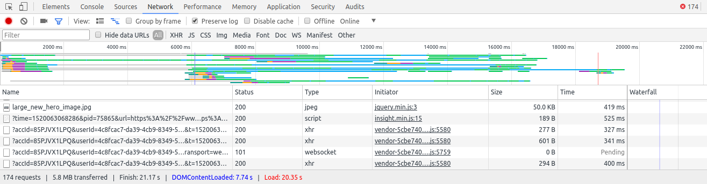
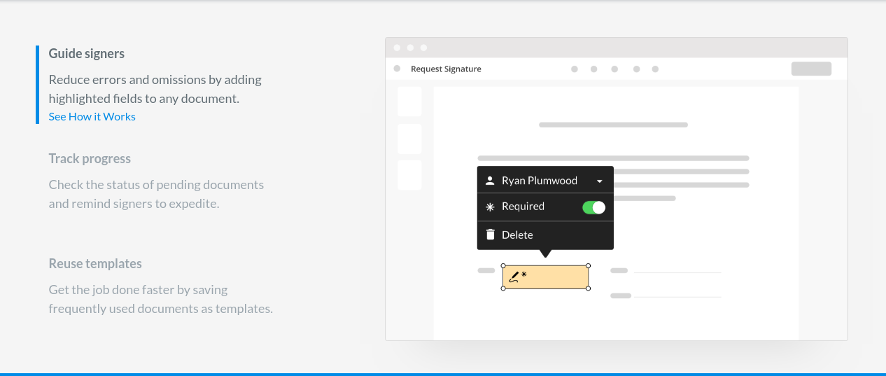
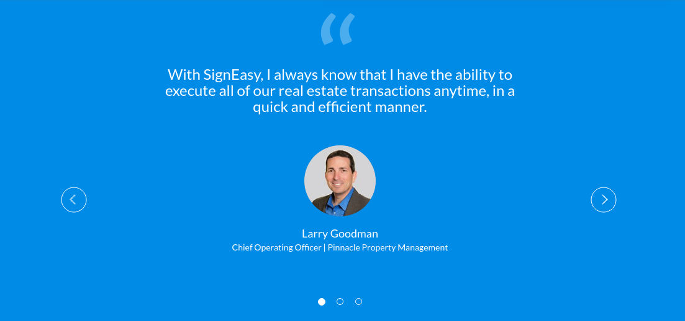
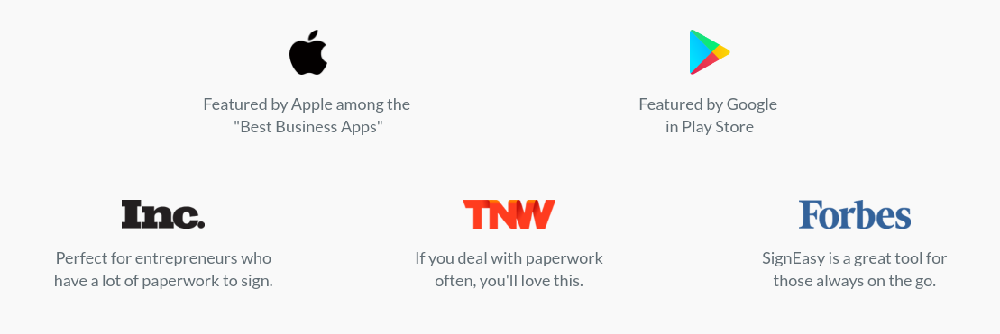

# SignEasy Website Review
I played around with the [SignEasy website](https://www.getsigneasy.com/), and the mobile app. I have some feedback:

## Performance

I noticed a few things that are affecting the performace of the site _negatively_. We could greatly improve the use experience by reducing the load and response times. _Faster the load time, higher the conversion rate._
- The site is loading multiple scripts in `<script>` tag and multiple css files. Whenever you load a script via `<script>` tag it makes a HTTP request to fetch that script. Every request has to go back and forth with the server and it increases load time. More info [here](https://blog.hubspot.com/marketing/reduce-http-requests). 
- From the [source code](view-source:https://www.getsigneasy.com/), it looks like asset bundlers are not being used, and the code is not minified.
- **174** HTTP requests are made to initialize the page, out of which 35 are for JS files and 22 are for CSS files. This is not ideal for a production app. 
- Quite honestly, the performance of the site is pretty bad. This needs to be addressed.

### Solution

- We can improve this greatly just by combining multiple css files into one file and all the js files into a single bundle using asset bundlers like Webpack or Browserify. This way we will have only a few files to load, which means we make _fewer_ HTTP requests to the server. This reduces the load time greatly and results in great user experience.

Here is what I'd do:

**TLDR:** _Bundle all JS files into a single file to reduce the number of HTTP requests. Minify and Uglify that JS file to reduce bundle size._

1. Use a module bundler like Webpack or Browserify or Parcel to bundle all JS files into a single JS file for production site to reduce the number of HTTP requests to initialize the page.
2. Use a minifier and uglifier to reduce the bundle size. When the bundle size is less, it loads quickly.
3. Bundle all css files into a single css file. Again, to reduce the number of HTTP requests we make   while loading the page for the first time.
4. I see a lot of JS and CSS written within the main HTML file. This prevents us from taking advantage of browser caching. When you load a JS/CSS file externally (using `<script>` and `<link>`), the browser will cache the file. This lets us load the website faster when the user reloads the page or performs an action that requires reflow of the webpage.
5. Many JS files are loaded in the `<head>` tag. They prevent the initial rendering of the page until they are loaded. I'd move them to the `<body>` tag wherever possible to **prevent render-blocking**.
6. More on [why we should reduce the number of HTTP requests](https://blog.hubspot.com/marketing/reduce-http-requests)

## Styles

**TLDR:** _Use naming convention like BEM, avoid inline styles, and reduce usage of !important_

- When multiple developers work on CSS, things tend to go out of hand quickly. Following a naming convention like [BEM](http://getbem.com/naming/) helps a lot in writing maintainable CSS.
- I see a lot of inline styles. Although they are okay on few occasions, it'd be good to have them in separate files and load via `<link>` tag to take advantage of browser caching. The inline styles are not reusable, and they are hard to modify in future. More [here.](https://softwareengineering.stackexchange.com/questions/319629/why-is-it-bad-to-use-inline-styling-in-html-for-generic-styles)
- Too many uses of `!important` => creates specificity issues. Results in hard-maintain CSS.

## Fallback measures:

**TLDR:** Serve minified local assets instead of using CDNs

- Many files are loaded from CDNs in your site. This creates hard-dependency on CDNs. If they go down for some reason, it'll break the site for no fault of yours. We can tell our site to fallback to our local files when CDN fails. More [here.](http://www.hanselman.com/blog/CDNsFailButYourScriptsDontHaveToFallbackFromCDNToLocalJQuery.aspx)

## Accessibility

- I believe technology should be accessible to every person. We can achieve this by paying little attention to accessibilty while developing our website.
- Most of the images in the site are missing `alt` attribute. Adding this will help the visually challenged people who use screen-readers.
- For example, the links to download the mobile apps at the bottom use images, and provide no `alt` text. For visually challenged users accessing the site through screen-readers, they won't be available at all.
- Some of the form controls are missing labels.
- Sufficient color contrast ratio is not maintained

## SEO

- The page is missing an `<h1>` tag. Having a great `<h1>` tag that describes your site increases the page rank of the site.

## Best Practices:

Following these best practices (missing from the current site) would be great:

- Use linters like ESLint, Bootlint => They help us reduce potential bugs.
- Use asset bundlers like webpack or browserify
- Use IDs for elements

## Other things

- I saw a bulletin on top with the link to download an e-book. Once the user closes it, there is no way of getting that link. It'd be great if there was a `downloads` section.
- The home page is huge. It'd be nice to add links to sections of the page so that users can share links that directly link to a section than the whole page.
- **console errors**: I see this console error `Uncaught TypeError: Cannot read property 'className' of undefined` over 100s of times. Just an FYI so that you can take a look.

## User Experience:

- Under the section 'Get documents signed instantly', the tabs 'Guide signers', 'Track progress', and 'Reuse templates' do not transition automatically. We should show maximum content to the users with minimum interaction. One solution is to transition automatically between these tabs, say every 2 seconds.
  
- Same for the carousal with feedback from Larry Goodman, Subramanya Sharma and others. If we don't transition, chances are the users will never click buttons to transition, and they'll never see that content.
	
- In the section for reviews by Inc., Forbes, etc, it'd be nice add links to the original articles when the user clicks on them. This provides at least 2 advantages:
	- Adds credibility to their reviews
	- The user will read more about the company
	
	

## Great things

- Wonderful product! It solves a real problem faced by many in a easy-to-use manner.
- I loved the overall look and feel of the website! It looks great!!
- Beautiful animations! The site feels smooth after the initial rendering phase.

# SignEasy App

It was a great experience using the app. The reviews by other users show their love too! The app is customer centric and I loved the way every query was answered in the reviews on the store.

One problem I noticed is that the app doesn't let the users select documents from the external storage (micro SD card). I had to copy my document from external storage to the internal storage before I was able to sign it. It'll be great user experience if they could select a document directly from the external storage.
